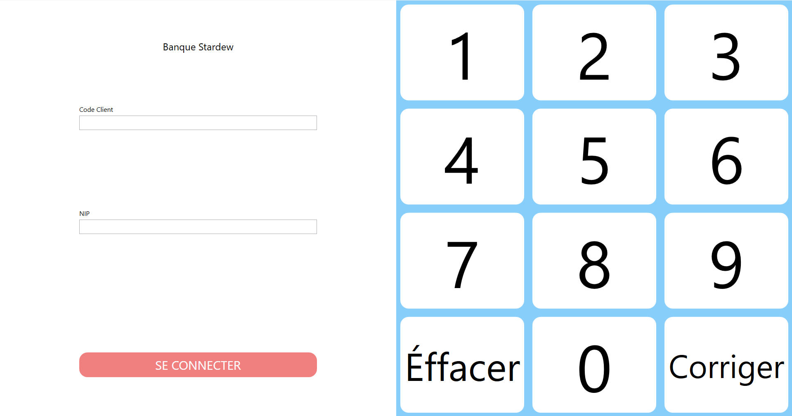
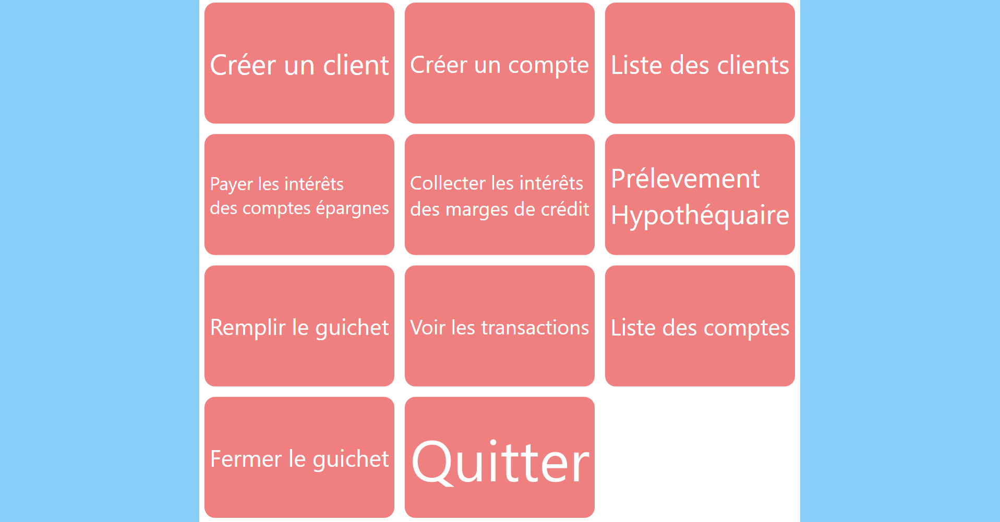
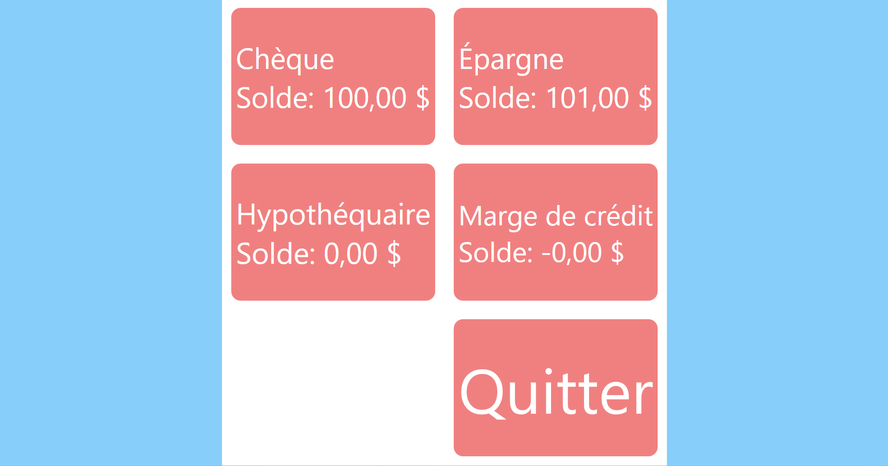

# AppGuichetSimulation
Simulation d’une application bancaire / guichet automatique développée en C# avec WPF et SQL Server.

## Fonctionalités
- Connexion en mode client ou administrateur
- Opérations bancaires variées :
  - dépôt
  - retrait
  - paiement de facture
  - transfert de fonds
- Visualisation des transactions
- Gestion d’une marge de crédit pouvant couvrir les découverts
- Creation de clients et de compte
- Gestion de l'argent disponible dans le guichet

## Technologies utilisées
- C#
- WPF
- Microsoft SQL server
- Entity framework core

## Installation
1. Installer la version développeur de Microsoft SQL Server
2. S’assurer que l’accès au serveur local par défaut (.) est disponible
3. Ouvrir le projet dans Visual Studio
4. Ouvrir la console NuGet :
   - **Tools / Outils**
   - **NuGet Package Manager**
   - **Package Manager Console**
5. Exécuter la commande suivante : Add-Migration UpdateModels
6. Exécuter la commande suivante : Update-Database

## Utilisation
- Se connecter avec l’utilisateur 100003 et le NIP 1234 pour ouvrir l’interface administrateur.
- Dans l’interface administrateur, il est possible :
  - de créer des clients
  - de créer des comptes
  - d’exécuter différentes opérations de gestion
- Dans l’interface client, l’utilisateur peut effectuer des opérations bancaires sur ses différents comptes

## Ce que j'ai appris
- Implémenter Entity Framework Core pour faire communiquer l’application avec la base de donnée
- Créer des données de départ (seed data) dans le modèle et le fichier de contexte
- Générer la base de données à partir du modèle avec les migrations
- Créer des contrôles personnalisés réutilisables, comme :
  - des boutons aux coins arrondis
  - un clavier numérique cliquable
- Approfondir mes connaissances de Entity Framework Core
- Améliorer ma compréhension des applications WPF et de leur mise en page

## Améliorations futures
- Ajouter d’autres types de comptes
- Ajouter d’autres types de transactions
- Ajouter d’autres types d’utilisateurs
- Uniformiser davantage le code lié au clavier numérique
- Ajuster davantage la mise en page pour une taille d’écran précise
- Chiffrer les données sensibles, comme le NIP, dans la base de données

## Aperçu

### Interface de connexion

### Interface administrateur

### Interface client

